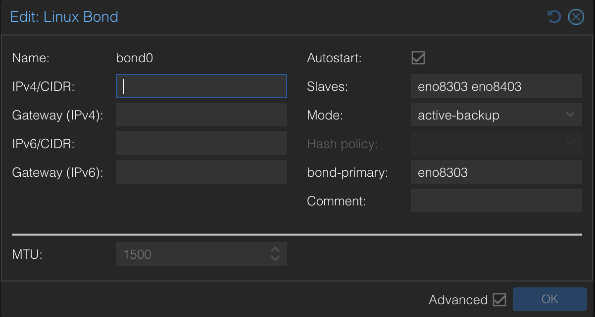
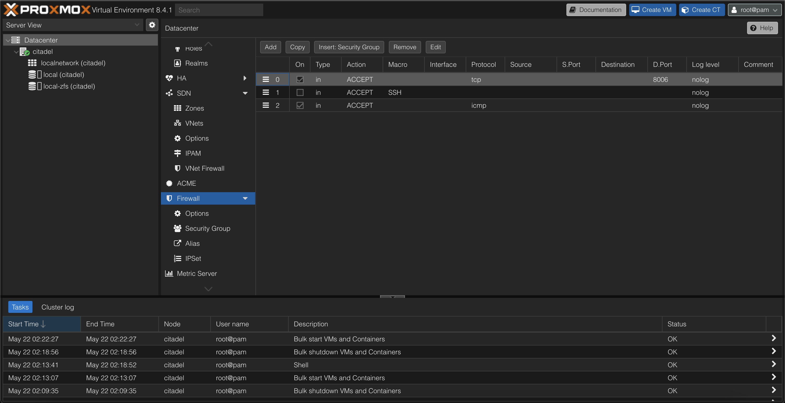

# Proxmox Setup

## Use 4K sectors

- Boot into a live ISO.
- Install the `nvme-cli` package.
- Check if the NVME drives support 4096 sector size with:

```
nvme id-ns /path/to/drive -H
```


- If the drives support 4096 sector size, run

```
nvme /path/to/drive -b 4096
```

## Initial filesystem config

- Boot into the installation media. Select the 1 single drive and set the filesystem as ZFS. 
  - ashift=12
  - compress=zstd
  - checksum=sha256
  - copies=1
  - ARC max size=2048 MiB
  - hdsize=32 GB

- Install Proxmox

## Setup bond
If the server has redundant networking, setup a bond (Ative-Backup or LACP):


 
Then set `vmbr0` bridge port to the bond.

## Intial setup script
The intial setup script to be run after installation is maintained [here](https://github.com/TommyTran732/Linux-Setup-Scripts).

## Setup Firewalling

Datacenter -> Firewall -> Add rules for PVE web panel, SSH, and ICMP
Datacenter -> Firewall -> Options -> Firewall -> Enable
Node name -> Firewall -> Options -> Enable TCP flags filter and nftables




## Format new drive
Format the first drive for the encrypted installation (different from the unencrypted drive the system currently runs on). For our purposes, lets call this first drive drive1.

```bash
drive1='/dev/disk/by-id/nvme-FIRSTDRIVESERIALNUMBER'
```

```bash
blkdiscard --force "${drive1}" # Or secure erase
sgdisk -g "${drive1}"
sgdisk -I -n 1:0:+1G -t 0:ef00 -c 0:'ESP' "${drive1}"
mkfs.fat "${drive1}-part1" -F 32 -n 'ESP'
proxmox-boot-tool clean
proxmox-boot-tool init "${drive1}-part1"
sgdisk -I -n 2:0:+32G -t 0:8309 -c 0:'PVE' "${drive1}"
sgdisk -I -n 3:0:0 -t 0:bf01 -c 0:'PVE Data' "${drive1}"
```

## Configure encrypted partition

```bash
apt install cryptsetup-initramfs
cryptsetup luksFormat "${drive1}-part2"
cryptsetup open --allow-discards --persistent "${drive1}-part2" cryptroot1

zpool create \
    -m none \
    -o ashift=12 \
    -o autoexpand=on \
    -o autotrim=on \
    -o comment='PVE' \
    -o failmode=wait \
    -O acltype=posix \
    -O atime=off \
    -O checksum=blake3 \
    -O compression=zstd-3 \
    -O dnodesize=auto \
    -O overlay=off \
    -O volmode=dev \
    -O xattr=sa \
    -O normalization=formD \
    pve /dev/mapper/cryptroot1
```

## Reconfigure the initramfs

```
echo "cryptroot1 ${drive1}-part2 x-initrd.attach,keyscript=decrypt_keyctl" >> /etc/crypttab
sed -i 's/rpool/pve/' /etc/kernel/cmdline
update-initramfs -u -k all
proxmox-boot-tool refresh
```

## Migrate to encrypted pool

```
zfs snapshot -r rpool/ROOT@copy
zfs send -R rpool/ROOT@copy | zfs receive pve/ROOT
```

## Cleanup

- Reboot into the new system.
- Wipe the old disk.