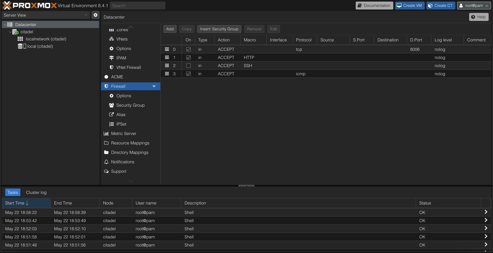

# Proxmox Setup

Credit to [@bban160](https://github.com/bban160) for helping with the filesystem setup.

## Use 4K sectors

- Boot into a live ISO.
- Install the `nvme-cli` package.
- Check if the NVME drives support 4096 sector size with:

```bash
nvme id-ns /path/to/drive -H
```


- If the drives support 4096 sector size, run

```bash
nvme /path/to/drive -b 4096
```

## Initial filesystem config

- Boot into the installation media. Select the 2 drives and use ZFS RAID 1. 
  - ashift=12
  - compress=zstd
  - checksum=sha256
  - copies=1
  - ARC max size=16384 MiB
  - hdsize=32 GB

- Install Proxmox

## Setup bond
If the server has redundant networking, setup a bond (Ative-Backup or LACP):


 
Then set `vmbr0` bridge port to the bond.

## Update DNS settings
- Make sure the search domain is appropriate
- Setup DNS servers (1.1.1.2, 1.0.0.2, 2606:4700:4700::1112)

## Intial setup script
The intial setup script to be run after installation is maintained [here](https://github.com/TommyTran732/Linux-Setup-Scripts).

## Setup Firewalling

Datacenter -> Firewall -> Add rules for PVE web panel, SSH, and ICMP
Datacenter -> Firewall -> Options -> Firewall -> Enable
Node name -> Firewall -> Options -> Enable TCP flags filter and nftables




## Reformat the first drive
Format the first drive for the encrypted installation (different from the unencrypted drive the system currently runs on). For our purposes, lets call this first drive drive1.

```bash
drive1='/dev/disk/by-id/nvme-FIRSTDRIVESERIALNUMBER'
```

```bash
zpool detach rpool "${drive1}"
blkdiscard --force "${drive1}" # Or secure erase
wipefs "${drive1}" --all
sgdisk -g "${drive1}"
sgdisk -I -n 1:0:+1G -t 0:ef00 -c 0:'ESP' "${drive1}"
mkfs.fat "${drive1}-part1" -F 32 -n 'ESP'
proxmox-boot-tool clean
proxmox-boot-tool init "${drive1}-part1"
sgdisk -I -n 2:0:+32G -t 0:8309 -c 0:'PVE' "${drive1}"
sgdisk -I -n 3:0:0 -t 0:bf01 -c 0:'PVE Data' "${drive1}"
```

## Configure pve pool

```bash
apt install cryptsetup-initramfs
cryptsetup luksFormat "${drive1}-part2"
cryptsetup open --allow-discards --persistent "${drive1}-part2" cryptroot1

zpool create \
    -m none \
    -o ashift=12 \
    -o autoexpand=on \
    -o autotrim=on \
    -o comment='PVE' \
    -o failmode=wait \
    -O acltype=posix \
    -O atime=off \
    -O checksum=blake3 \
    -O compression=zstd-3 \
    -O dnodesize=auto \
    -O overlay=off \
    -O volmode=dev \
    -O xattr=sa \
    -O normalization=formD \
    pve /dev/mapper/cryptroot1
```

## Reconfigure the initramfs

```bash
echo "cryptroot1 ${drive1}-part2 pve initramfs,keyscript=decrypt_keyctl" >> /etc/crypttab
sed -i 's/rpool/pve/' /etc/kernel/cmdline
zfs set mountpoint=none rpool
zfs set mountpoint=none rpool/ROOT
zfs set mountpoint=none rpool/ROOT/pve-1
zfs set mountpoint=none rpool/data
zfs set mountpoint=none rpool/var-lib-vz
update-initramfs -u -k all
```

## Migrate to pve pool

```bash
zfs snapshot -r rpool/ROOT@copy
zfs send -R rpool/ROOT@copy | zfs receive pve/ROOT
```

## Clean up and partition the second drive

- Reboot into the new system
- Datacenter -> Storage -> Remove `local-zfs`.

Let's call the second drive drive2:

```bash
drive2='/dev/disk/by-id/nvme-SECONDDRIVESERIALNUMBER'
```

```bash
zfs export rpool
rm -rf /rpool
blkdiscard --force "${drive2}" # Or secure erase
wipefs "${drive2}" --all
sgdisk -g "${drive2}"
sgdisk -I -n 1:0:+1G -t 0:ef00 -c 0:'ESP' "${drive2}"
mkfs.fat "${drive2}-part1" -F 32 -n 'ESP'
proxmox-boot-tool clean
proxmox-boot-tool init "${drive2}-part1"
sgdisk -I -n 2:0:+32G -t 0:8309 -c 0:'PVE' "${drive2}"
sgdisk -I -n 3:0:0 -t 0:bf01 -c 0:'PVE Data' "${drive2}"
```

## Add second drive to encrypted pool

```bash
cryptsetup luksFormat "${drive2}-part2" # Use the same password as the other partition
cryptsetup open --allow-discards --persistent "${drive2}-part2" cryptroot2
zpool attach pve /dev/mapper/cryptroot1 /dev/mapper/cryptroot2
```

## Reconfigure the initramfs

```bash
echo "cryptroot2 ${drive2}-part2 pve initramfs,keyscript=decrypt_keyctl" >> /etc/crypttab
update-initramfs -u -k all
```

## Change root password

```bash
passwd
```

## Rotate Proxmox Secrets

```bash
rm -rf .ssh/*
ssh-keygen -t rsa -b 16384 -C root@<NODE NAME> -N '' -f /root/.ssh/id_rsa # You must generate an RSA key. If you generate an ed25519 key and name it id_rsa, Proxmox will keep spamming the authorized_keys file every boot.
rm /etc/ssh/ssh_host_*
dpkg-reconfigure openssh-server
rm -rf /etc/pve/priv/*
reboot
```

## Setup TLS certificate

- Datacenter -> ACME -> Add an account
- Setup CAA records
- Node Name -> Certificates -> ACME -> Add a challenge and order a certificate

## WebAuthn
- Open Proxmox using its FQDN
- Datacenter -> Options -> WebAuthn Settings -> Autofill
- Datacenter -> Permissions -> Two Factor -> Register security key

## Cleanup old snapshots

```bash
zfs destroy pve/ROOT/pve-1@copy
zfs destroy pve/ROOT@copy
```

## Remove GRUB

GRUB is completely unused, and will never be used with this this style of Proxmox deployment.

```bash
apt purge grub* --allow-remove-essential
rm -rf /var/lib/grub
rm -rf /boot/grub
```

## Setup PVE Data pool

- UMask 077
- Put your encryption password in `/.pve-data.key`

```bash
chattr +i /.pve-data.key
```

```bash
drive1='/dev/disk/by-id/nvme-FIRSTDRIVESERIALNUMBER'
drive2='/dev/disk/by-id/nvme-SECONDDRIVESERIALNUMBER'

zpool create \
    -m none \
    -o ashift=12 \
    -o autoexpand=on \
    -o autotrim=on \
    -o comment='PVE Data' \
    -o failmode=wait \
    -O acltype=posix \
    -O atime=off \
    -O checksum=blake3 \
    -O compression=zstd-3 \
    -O dnodesize=auto \
    -O encryption=on \
    -O keyformat=passphrase \
    -O keylocation='file:///.pve-data.key' \
    -O overlay=off \
    -O volmode=dev \ # Comment this out if you intend to add physical drives to the same pool
    -O xattr=sa \
    -O normalization=formD \
    pve-data mirror "${drive1}-part3" "${drive2}-part3"

zfs create pve-data/data
zfs create -o mountpoint=/var/lib/vz pve-data/var-lib-vz
```

You may see an error saying "cannot mount '/var/lib/vz': directory is not empty, that is fine. Rectify it by quickly running these 2 commands:

```bash
rm -rf /var/lib/vz/*
zfs mount -a
```

Go to Datacenter -> Storage and add the pve-data/data dataset:


## Setup automatic unlocking

- Change back to UMask 022
- Put the following inside `/etc/systemd/system/zfs-load-key.service`:

```
[Unit]
Description=Load encryption keys
DefaultDependencies=no
After=zfs-import.target
Before=zfs-mount.service

[Service]
Type=oneshot
RemainAfterExit=yes
ExecStart=/usr/sbin/zfs load-key -a

[Install]
WantedBy=zfs-mount.service
```

- Enable the service:

```bash
systemctl enable zfs-load-key
```

# iDRAC Integration

```bash
curl -fsSL https://linux.dell.com/repo/pgp_pubkeys/0x1285491434D8786F.asc | gpg --dearmor -o /usr/share/keyrings/dell.gpg

echo 'Types: deb
URIs: https://linux.dell.com/repo/community/openmanage/11100/jammy/
Suites: jammy
Components: main
Signed-By: /usr/share/keyrings/dell.gpg

Types: deb
URIs: https://linux.dell.com/repo/community/openmanage/iSM/5400/bullseye
Suites: bullseye
Components: main
Signed-By: /usr/share/keyrings/dell.gpg' > /etc/apt/sources.list.d/dell.sources

echo 'deb https://deb.debian.org/debian/ bullseye main

deb https://security.debian.org/debian-security/ bullseye-security main

deb https://deb.debian.org/debian/ bullseye-updates main' > /etc/apt/sources.list.d/bullseye.list

echo 'Package: *
Pin: release n=bullseye
Pin-Priority: 100

Package: *
Pin: release n=bullseye-security
Pin-Priority: 100

Package: *
Pin: release n=bullseye-updates
Pin-Priority: 100' > /etc/apt/preferences.d/99bullseye

apt update
apt install -y dcism srvadmin-idracadm8
```

# Secure Boot Setup

Will be implemented once `systemd-ukify` becomes available on Proxmox.
